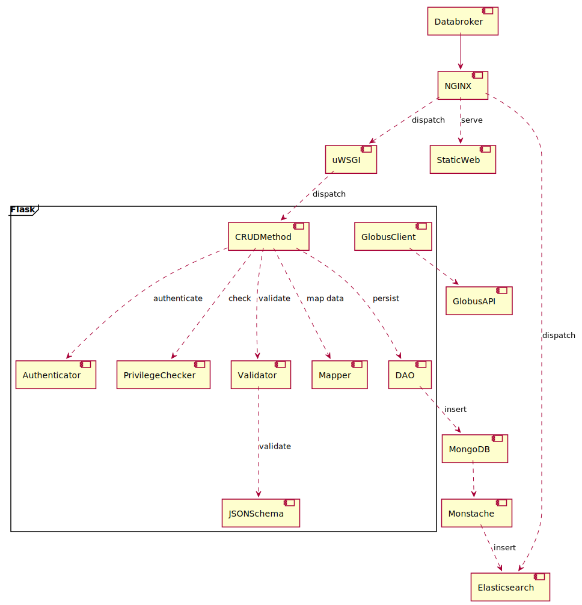

# Design
"Splash" is a web service, browser application and database. It consumes experiment data from a variety of sources
* REST API 
* Bluesky Databroker

It provides a web-friendly API and browser-based UI for searching and viewing experiment data.

## Components

### NGINX
NGINX serves as the web front end. It handles three principle types of requests
* Static Web Resource - javascript, images, html, css, etc.
* REST Requests for the API - NGINX serves as a reverse proxy for REST API requests
* REST Requests for search - NGINX serves as a reverse proxy for search requests, passing them directly to the Elastisearch service.

### Databroker
Databroker injests data and metadata from beamlines and dispatches them for insertion into the MongoDB.

### uWSGI
uWSGI manages Flask processes. This is useful for scaling the Flask-based API.

### Flask
Flask is used to wrap RESTful methods that encompass the API. These methods are not limited to a restful RESTful pattern, but are structured as CRUD-ful.

### High Level Classes
#### CRUDMethod
The CRUDMethod is a class that handles the workflow of CRUD requests. Subclasses of CRUDMethod will services request by resource type. Generally, there will be a mapping from RESTful resource to CRUDMethod to Mongo Collection.

#### Authenticator
The Authenticator manages authentication for requests. This applies whether requests come from a user in the browser app or another RESTful client. [Much more detail to come.]

#### PrivilegeChecker
The PrivilegeChecker handles checking whether the user has view, insert or update privilages for the requested resource.

#### Validator
The Validator validates the incoming message payload for Create and Update methods. The validator will find the relevant JSONSchema for the incoming document and validate the payload against it. [For updates, this may mean marshalling the document, updating it and the validating. More to come...] 

#### DAO
Data Access Objects handle access to the database.

#### GlobusClient
Splash will handle data transfer requests and forward them on Globus. [Much more to come]

#### Databases
Splash uses two primary storage systems. MongoDB is the principle system and the "truth" for metadata and experiment metadata (when "small"). Elasticsearch is used as a search and indexing tool. Inserts and updates to MongoDB are (partially) reflected in Elasticsearch in order to build a search index.

## Document Data Model
As [mentioned previously](#crudmethod), there is a mapping from resources mapped in REST to CRUD methods to document collections in Mongo. Each resource will be maintained by a JSONSchema which can be validated against. The schema will contain a combination of required fields and object and slots for more free-form content. Below is list of the currently-designed schemas.

### Experiment
An [experiment](https://github.com/als-computing/splash-server/blob/master/schema/experiment_schema.json) is a high level concept that encompasses experimental condidition, samples, trials, users and results. 

## Web Site
The [web site](#staticweb) is an Single Page App with very minimal HTML defined on the server. It is built principally making RESTful requests to to populate Vue View componenents. Axios handles those RESTful requests.

### Search
Searching is performed by making requests to Elasticsearch. Search results from Elasticsearch are displayed to the user with links that result in requestst to Mongo. c