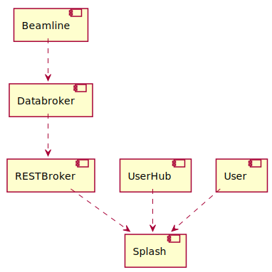

# Introduction
Splash is a database and api platform designed to store metadata about experiments (and, when the experiment data itself is small, it stores that, too!). 

The need that Splash fills is that researchers from a variety of backgrounds, doing a variety of types of research, in a variety of locations, want to be able to see eachother's work. Once Splash ingests data about experiments, researchers can see it (privately, if desired), curate it and publish it.

Splash aims to be very flexible with ingestion. It has a REST service that ingests experiment data. Experiments can be create by users or through integrations with 3rd party systems.

Systems can continuously update splash as experiments are conduction. One such method is through Bluesky Databroker, which has an event-based update model. It is envisioned that a REST client will be developed that can feed events to Splash.

A grossly-over-simplified picture of Splash deployed at a synchotron might look like:

